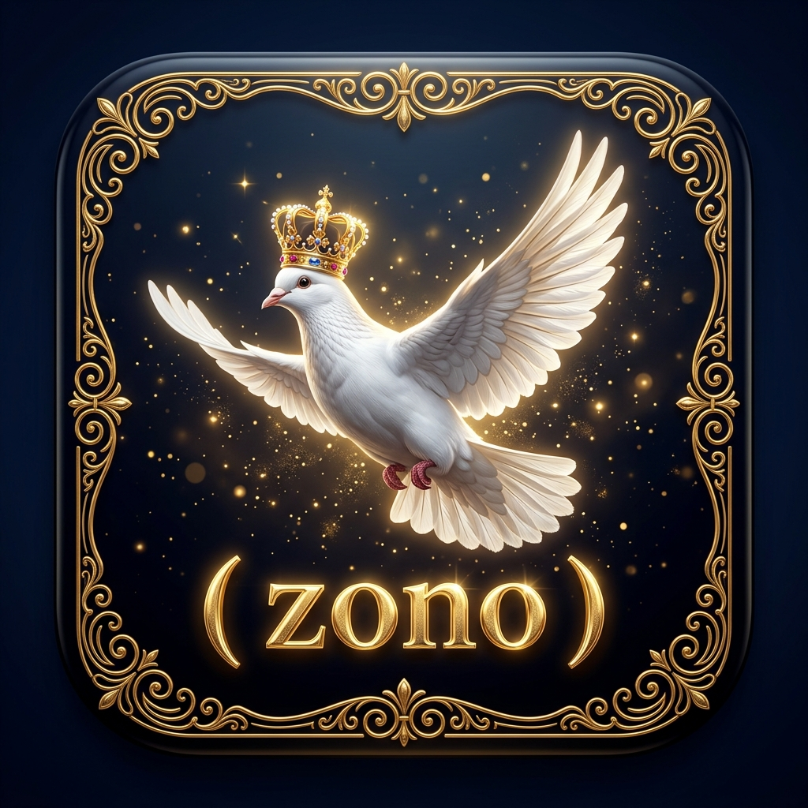

# 👑 ( zono ) — The Sovereign Royal Messenger

<div align="center">
  
  <br/><br/>
  
  [](https://USERNAME.github.io/zono/)
  [](https://github.com/)
  [](https://github.com/)
  [](LICENSE)

  <p dir="rtl" style="font-size: 1.25rem; font-weight: bold; color: #dfba5b;">
    <b>« بين عبق الماضي الملكي وسرعة تكنولوجيا الحاضر »</b>
  </p>
</div>

---

## 📖 نبذة عن المشروع | Overview

مشروع **( zono )** هو واجهة دخولية فاخرة وأيقونة تطبيق ملكية متكاملة مصممة خصيصاً لتجمع بين **الأصالة التاريخية (الزاجل الأبيض، التاج الذهبي، النقوش الملكية)** و**الحداثة العصرية (التأثيرات ثلاثية الأبعاد 3D، الإضاءة الذهبية المتوهجة، ونظام صوت الطير التفاعلي)**.

المشروع جاهز تماماً للرفع المباشر على **GitHub** وتشغيله كـ **GitHub Pages** بنقرة واحدة أو تضمينه في تطبيقات الهاتف (Flutter, React Native, iOS, Android, Web).

---

## ✨ المميزات الرئيسية | Features

- 🕊️ **طائر الزاجل الأبيض (Realistic Carrier Pigeon):** تصميم واقعي ثلاثي الأبعاد يعكس السرعة والنقاء والرسائل الملكية.
- 👑 **التاج الذهبي (Royal Golden Crown):** تاج مرصع ومشع فوق اسم المشروع وشعار التطبيق.
- 💫 **الاسم المضيء بين قوسين `( zono )`:** توهج نيون ذهبي ديناميكي مع تأثير التدرج المعدني اللامع.
- 🔊 **محاكي صوت الطير الملكي (Interactive Web Audio Engine):**
  - صوت تغريد وهديل الزاجل الحي.
  - صوت رفرفة الأجنحة عند الإقلاع.
  - نغمات القيثارة والأجراس الذهبية عند الدخول.
  - *يعمل بالكامل دون الحاجة لملفات صوت خارجية قابلة للتلف.*
- 📱 **أيقونة التطبيق بجودة فائقة (App Icon & SVG Vector):**
  - أيقونة 512x512 مربعة بحواف منحنية للموبايل والويب.
  - ملف SVG فيكتور عالي الدقة غير محدود التكبير.
- 🌌 **خلفية دخولية سينمائية (Cinematic Splash Screen):** تجمع بين القصر الملكي والزجاج العصري.
- ⚡ **تأثيرات ثلاثية الأبعاد (3D Gyroscope & Mouse Tilt):** استجابة البطاقة لحركة الماوس وحساسات الهاتف.

---

## 🚀 طريقة الرفع على GitHub وتشغيل الموقع مجاناً | GitHub Deployment

### 1️⃣ تهيئة المستودع ورفع الملفات
افتح الـ Terminal أو Command Prompt داخل مجلد المشروع ونفذ:

```bash
git init
git add .
git commit -m "feat: Initial release of ( zono ) Royal Splash & App Icon"
git branch -M main
git remote add origin https://github.com/YOUR_USERNAME/zono.git
git push -u origin main
```

### 2️⃣ تفعيل GitHub Pages (رابط مباشر مجاني)
1. اذهب إلى صفحة المستودع على **GitHub**.
2. اضغط على **Settings** > **Pages** من القائمة الجانبية.
3. تحت **Branch**، اختر `main` واضغط **Save**.
4. خلال ثوانٍ سيصبح موقعك متاحاً عالمياً على:
   `https://YOUR_USERNAME.github.io/zono/`

---

## 📁 هيكلية الملفات | Project Structure

```
zono-project/
├── index.html              # الصفحة الرئيسية والدخولية التفاعلية
├── style.css               # التنسيقات الملكية وتأثيرات الإضاءة والزجاج
├── app.js                  # محرك الصوت وتوليد النغمات وجزيئات الذهب 3D
├── manifest.json           # ملف PWA لتثبيت التطبيق على الجوال
├── README.md               # التوثيق والشرح
└── assets/
    └── images/
        ├── icon.jpg        # أيقونة التطبيق عالية الدقة 512x512
        ├── splash-bg.jpg   # الخلفية السينمائية الملكية 16:9
        ├── icon.svg        # الشعار الفيكتور الملكي القابل للتكبير
        └── favicon.svg     # أيقونة المتصفح
```

---

## 📜 الترخيص | License

هذا المشروع مرخص تحت رخصة **MIT**. متاح للاستخدام الشخصي والتجاري لمشروع `zono`.
